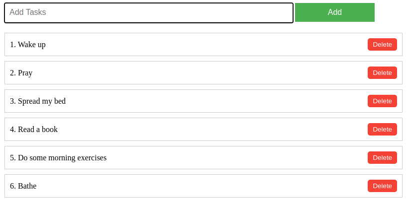

# To-do-list

This is a To-do-list web application that allows users to add, delete, and number tasks. It is designed using HTML, CSS, and JavaScript. You can view the live demo of the project by visiting this link: https://superlative-kashata-ac54cc.netlify.app/

## Features

- Add tasks to the list with automatic numbering
- Delete tasks from the list
- Responsive design
- Add tasks by pressing the Enter key or clicking the "Add" button

## How to Use

1. Enter a task name in the input field.
2. Press the Enter key or click the "Add" button to add the task to the list.
3. To delete a task, click the "Delete" button next to the task name.

## Project Structure

- `index.html`: The main HTML file containing the structure of the web page.
- `style.css`: The CSS file containing the styles for the web page.
- `system.js`: The JavaScript file containing the functionality for adding and deleting tasks.

## Preview

Here is a preview of the To-do-list:

## License

This project is open-source and available for anyone to use and modify. Enjoy!

# By..
